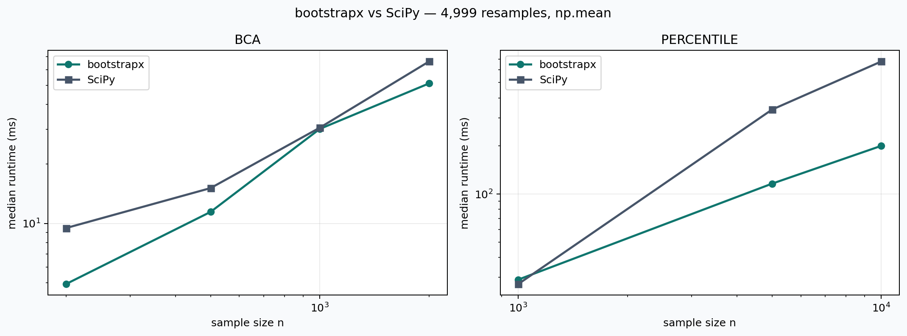
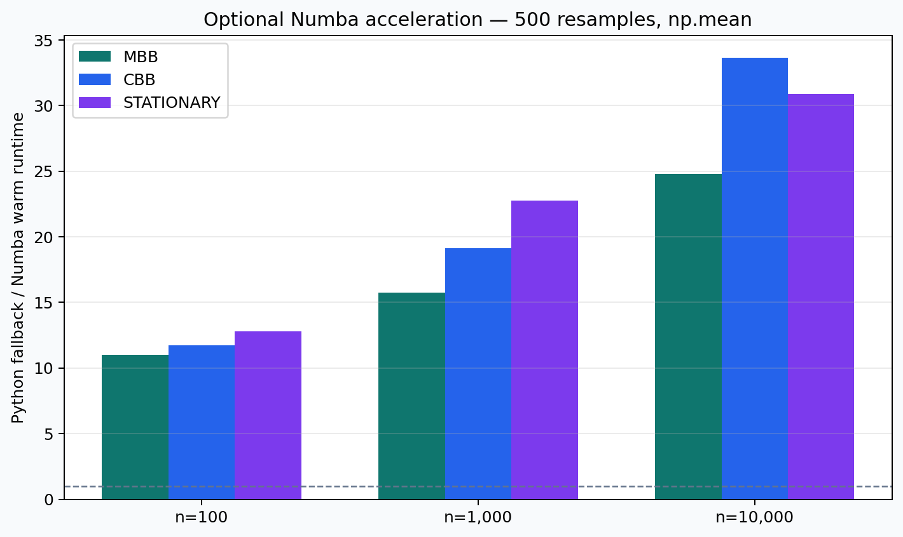
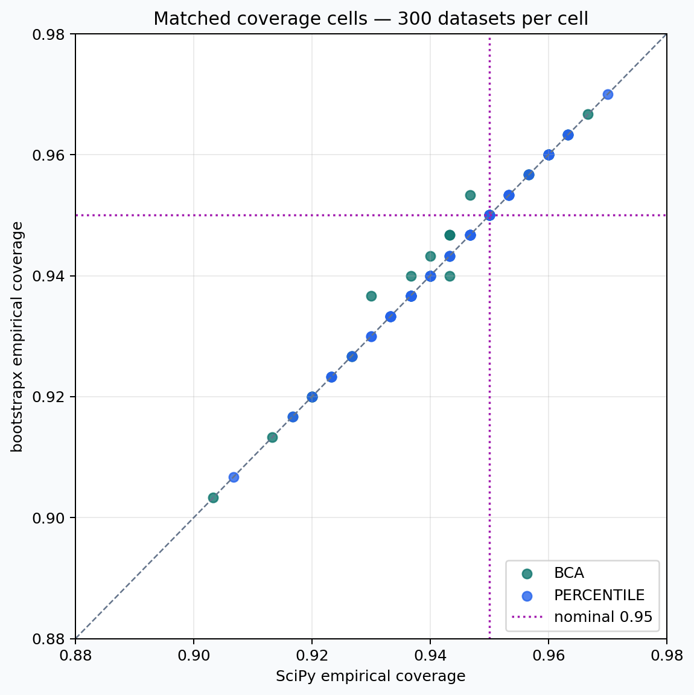

# Benchmarks

Benchmarks answer three different questions and should not be mixed:

1. **Runtime:** how long one configured call takes on one machine.
2. **Working memory:** how much memory that call allocates under a stated tool.
3. **Statistical behavior:** how often an interval covers a known parameter
   across independently generated datasets.

A speed benchmark cannot establish statistical correctness, and increasing
`n_resamples` reduces Monte Carlo noise but does not repair systematic
undercoverage caused by an unsuitable method.

## 0.5.0 experiment-comparison evidence

The 0.5.0 suite is separate from the audited 0.4.4 one-sample results. It
checks independent, paired, and clustered comparisons; difference and
relative-lift effects; normal, lognormal, exponential, and Bernoulli data; and
percentile, basic, and BCa intervals. Applicable independent/paired cells are
matched with SciPy. Cluster cells have no SciPy row because SciPy does not
provide a cluster-ID experiment interface.

Run the pipeline smoke test:

```bash
python benchmarks/run_comparison_release.py \
  --profile quick \
  --output-dir benchmark_runs/v0.5.0-quick
```

The quick profile uses only two datasets per selected coverage cell and is not
statistical evidence. Before publishing 0.5.0, run the checkpointed release
profile from a clean commit:

```bash
python benchmarks/run_comparison_release.py \
  --profile release \
  --output-dir benchmark_runs/v0.5.0-release
```

Resume the identical commit, environment, and configuration after an
interruption:

```bash
python benchmarks/run_comparison_release.py \
  --profile release \
  --output-dir benchmark_runs/v0.5.0-release \
  --resume
```

The release profile uses 300 datasets and 4,999 resamples per cell. The
optional `--profile statistical` uses 1,000 datasets per cell and can take
several times longer. Both profiles record empirical coverage, Wilson bounds,
invalid/failing trials, random-stream policy, versions, commit, platform, and
elapsed time.

Runtime and `tracemalloc` results are produced by
`benchmarks/bench_two_sample.py`. They compare mean-difference workflows with
SciPy and track clustered runtime separately. No numeric 0.5.0 performance or
coverage claim should be published until the release directory has been
reviewed and versioned.

## Audited 0.4.4 release runtime

Measured from the versioned 0.4.4 release run on Apple Silicon/macOS 15.7.4,
Python 3.11.5, NumPy 2.4.6, and SciPy 1.17.1. Each cell uses `np.mean`, 4,999
resamples, a fixed seed, one unmeasured warm-up, and the median of five calls.

| Method | n | bootstrapx (ms) | SciPy (ms) | SciPy / bootstrapx |
|---|---:|---:|---:|---:|
| BCa | 200 | 4.93 | 9.47 | 1.92× |
| BCa | 500 | 11.43 | 15.09 | 1.32× |
| BCa | 1,000 | 30.11 | 30.54 | 1.01× |
| BCa | 2,000 | 51.18 | 66.12 | 1.29× |
| Percentile | 1,000 | 29.06 | 27.27 | 0.94× |
| Percentile | 5,000 | 116.00 | 337.72 | 2.91× |
| Percentile | 10,000 | 200.18 | 676.19 | 3.38× |

A ratio above 1 means bootstrapx was faster in that cell. The crossover is
real: the benchmark does not support a blanket “bootstrapx is faster” claim.
Runtime also depends on dependency versions, CPU, statistic, batch size, and
sample shape.



Auditable inputs: [speed CSV](https://github.com/artyerokhin/bootstrapx/blob/main/benchmark_runs/v0.4.4-release/speed/speed.csv)
and [environment metadata](https://github.com/artyerokhin/bootstrapx/blob/main/benchmark_runs/v0.4.4-release/speed/metadata.json).

Arbitrary-callable results were similarly mixed. For `n=1,000`, trimmed mean
took 566.89 ms versus SciPy's 602.13 ms, while IQR took 1,138.10 ms versus
1,170.37 ms. These numbers do not predict the cost of another callable.

## Memory measurement

The release benchmark's `tracemalloc` peak for BCa was 0.224 MB versus 38.149
MB at `n=500`, and 0.340 MB versus 152.567 MB at `n=2,000`. This supports the
narrow claim that batching greatly reduced allocations visible to
`tracemalloc` in this configuration.

Auditable input: [memory CSV](https://github.com/artyerokhin/bootstrapx/blob/main/benchmark_runs/v0.4.4-release/speed/memory.csv).

It is not a process-RSS or native-allocator guarantee. bootstrapx retains the
bootstrap distribution and method-specific arrays, so total memory is not
constant. A future release benchmark should add peak RSS alongside
`tracemalloc` before stronger memory claims are made.

## Optional Numba acceleration

```bash
pip install -e ".[numba]"
python benchmarks/bench_numba.py
```

This compares the same public `bootstrap` workflow against bootstrapx's Python
fallback. It reports first-process-call latency separately from warm runtime.
Only MBB, CBB, stationary, and the block-index portion of tapered bootstrap use
Numba. See [When Numba helps](integrations.md#when-numba-helps).

In this release run, warm end-to-end `np.mean` calls with 500 resamples were
11–34× faster with Numba for MBB, CBB, and stationary bootstrap across
`n=100`–`10,000`. The first process call ranged from 0.007 to 0.121 seconds;
it is a local startup measurement, not a latency guarantee.



## Statistical coverage

The release study completed all 160 planned matched cells: BCa and percentile
intervals; mean, median, and standard deviation; `n=200`, 500, 1,000, and
2,000; and the distributions defined by the benchmark. Every cell used 300
independently generated datasets, 4,999 resamples, and independent deterministic
streams for data generation and resampling. No trial failed or produced an
invalid interval.

Mean empirical coverage was 94.23% for bootstrapx BCa, 94.26% for bootstrapx
percentile, 94.17% for SciPy BCa, and 94.26% for SciPy percentile. The largest
matched bootstrapx/SciPy difference was 0.67 percentage points. This is useful
agreement evidence, but not a universal accuracy certificate: with 300 trials,
a single cell's 95% Wilson interval is roughly six percentage points wide. Both
libraries, for example, covered the standard deviation of exponential data at
`n=200` only 90.33% (BCa) and 90.67% (percentile) of the time.



The [coverage CSV](https://github.com/artyerokhin/bootstrapx/blob/main/benchmark_runs/v0.4.4-release/coverage/coverage.csv)
includes coverage, Wilson bounds, failures, and invalid trials for every cell;
the [metadata](https://github.com/artyerokhin/bootstrapx/blob/main/benchmark_runs/v0.4.4-release/coverage/metadata.json)
records the exact commit and environment. It is more informative to inspect
the cells matching your statistic and data distribution than to rely on the
overall mean.

## Reproduce the speed subset

```bash
python benchmarks/bench_speed.py --quick
```

When publishing a new result, record CPU, OS, Python, NumPy, SciPy and Numba
versions, commit hash, `n`, `n_resamples`, statistic, method, block setting,
warm-up policy, repeat count, and memory measurement tool.

## Run the 0.4.4 release suite

Create a clean environment from the release-candidate branch:

```bash
python3 -m venv .venv-bench
source .venv-bench/bin/activate
python -m pip install --upgrade pip
python -m pip install -e ".[dev,numba]"
```

Start with the quick profile. It verifies every benchmark pipeline and produces
real speed/Numba measurements, but its two-simulation coverage result is only a
smoke test:

```bash
python benchmarks/run_release.py \
  --profile quick \
  --output-dir benchmark_runs/v0.4.4-quick
```

Then run the release profile. It uses 300 datasets per coverage cell; this run
took about 39 minutes on the M1 machine above, and may take longer elsewhere:

```bash
python benchmarks/run_release.py \
  --profile release \
  --output-dir benchmark_runs/v0.4.4-release
```

If the process is interrupted, run the identical command with `--resume`:

```bash
python benchmarks/run_release.py \
  --profile release \
  --output-dir benchmark_runs/v0.4.4-release \
  --resume
```

For tighter statistical estimates, use 1,000 simulations per cell. Expect it
to take several times longer than the release profile rather than treating it
as a normal CI job:

```bash
python benchmarks/run_release.py \
  --profile statistical \
  --output-dir benchmark_runs/v0.4.4-statistical
```

An optional 2,000-simulation coverage run is available separately:

```bash
python benchmarks/bench_coverage_accuracy.py \
  --full \
  --output-dir benchmark_runs/v0.4.4-coverage-full
```

All profiles preserve previous runs, record the exact environment and commit,
and checkpoint coverage after each configuration. Avoid other CPU-heavy work
during runtime measurements and keep the Mac connected to power. After the run,
share the chosen `benchmark_runs/v0.4.4-*` directory; README tables and plots
should be generated only from that directory.
